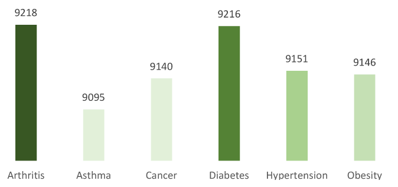
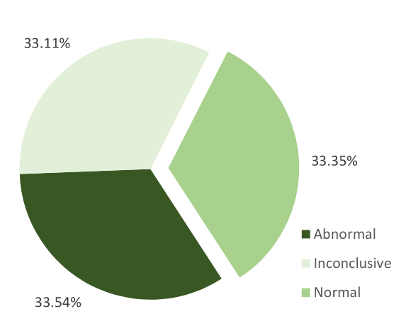
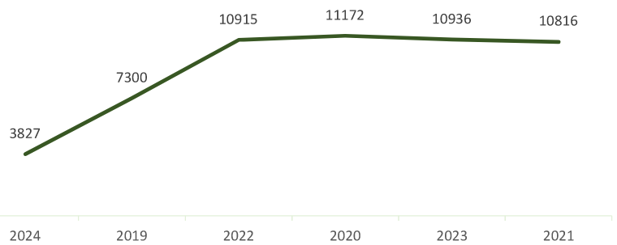
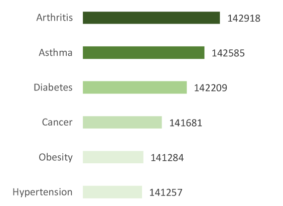
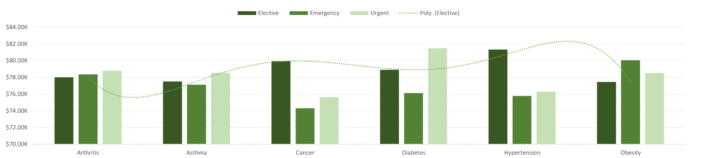
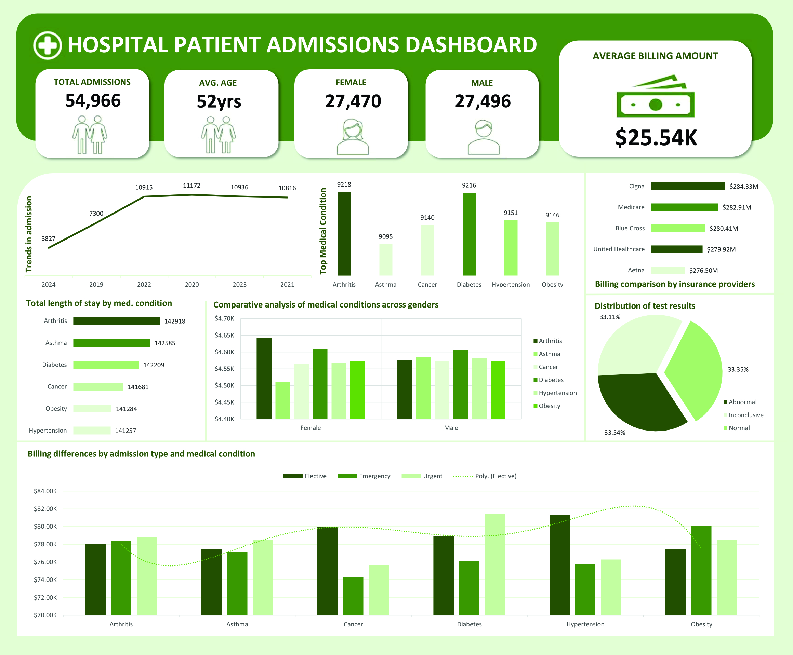

#  Exploratory and Insightful Analysis of Hospital Patient Admissions

##  Abstract

This project explores hospital patient admissions using a structured healthcare dataset.  
The analysis focuses on trends in **demographics**, **admission types**, **medical conditions**, and **billing patterns**.  
We examine how factors such as **age**, **insurance provider**, and **medical condition** impact **patient outcomes** and **costs**.  
The findings can guide healthcare administrators to improve **efficiency** and **patient care strategies**.

---

##  Introduction

This project provides detailed information on patients, their admission records, and healthcare services received.

Key goals:
- Explore patterns in hospital admissions
- Identify key factors influencing **billing amount** and **admission types**
- Derive **actionable insights** for better healthcare planning

---

##  Data Understanding & Cleaning

###  Step 1: Inspect the Dataset

| Task                        | Description                                       |
|----------------------------|---------------------------------------------------|
|  Check Structure          | Examine column names, data types, and null values |
|  Missing Values           | Count and visualize missing values                |
|  Duplicates               | Detect and remove duplicate rows                  |
|  Convert Dates            | Convert `Date of Admission` and `Discharge Date` to date format |

###  Step 2: Feature Engineering

| Feature                     | Description                                               |
|----------------------------|-----------------------------------------------------------|
|  Length of Stay          | `Discharge Date - Date of Admission`                     |
|  Admission Month         | Extract month from `Date of Admission`                    |

---

##  Exploratory Data Analysis (EDA)

###  Demographics
-  **Total Female Patients:** 27,470  
-  **Total Male Patients:** 27,496  
-  **Average Age:** 52 years  

---

###  Medical Profile
-  **Top Medical Conditions:** Hypertension, Obesity, Diabetes

-  **Test Results Distribution:**
  - Normal: 33.35%
  - Abnormal: 33.54%
  - Inconclusive: 33.11%   

---

###  Admission Details
-  **Trends Over Time:** Stable admissions from 2021–2022

-  **Length of Stay:** Higher for Arthritis & Asthma  

   **Admission Types:** `Mix of Elective, Emergency, Urgent`  

---

###  Billing Patterns
-  **Average Billing Amount:** $25.54K 
-  **Top Insurers by Billing:** Cigna, Medicare, Blue Cross
-  **Billing by Condition & Admission Type:** Highest for emergency and chronic cases

---
###  Why This Analysis Matters
This project goes beyond charts, it reveals how hospitals can cut costs, improve care, and plan smarter:

- Prevent high cost conditions by identifying frequent and expensive diagnoses

- Reduce emergency billing through early detection and better admission planning

- Use seasonal trends to anticipate patient spikes and allocate staff/resources in advance

- Improve care with unbiased test result analysis and condition specific length of stay insights

##  Key Insights & Recommendations

- Focus prevention programs on **Arthritis** and **Asthma**
- Elective & urgent admissions drive **higher costs**
- Balanced gender distribution supports **unbiased medical review**
- Insurance providers like **Cigna** contribute the most — useful for negotiation
- Watch seasonal trends in admissions for **resource planning**

---

##  Project Files
📁 Healthcare-Admissions-Project/  
├── 📄 [See README](./README.md)  
├── Healthcare Project Dashboard  

